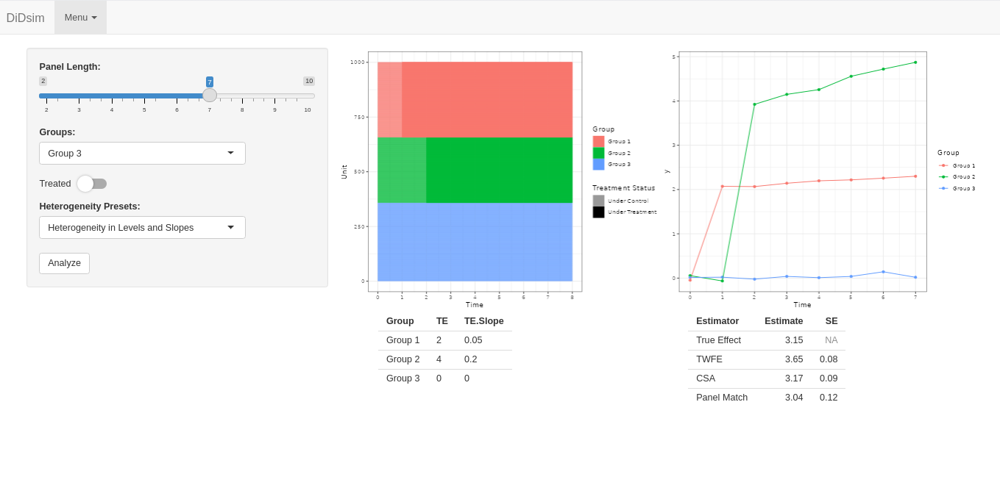
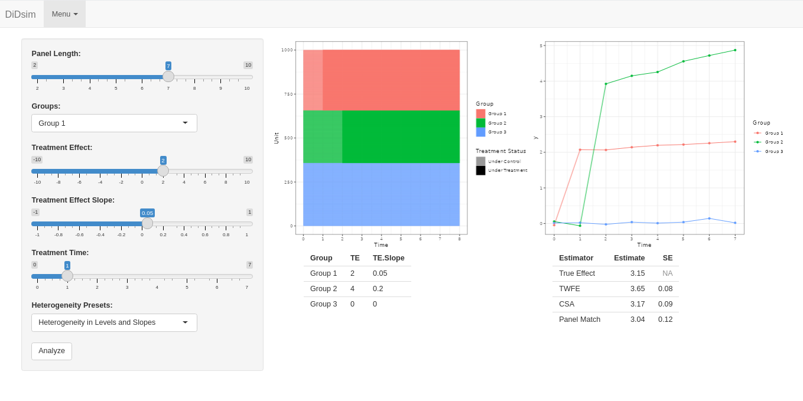
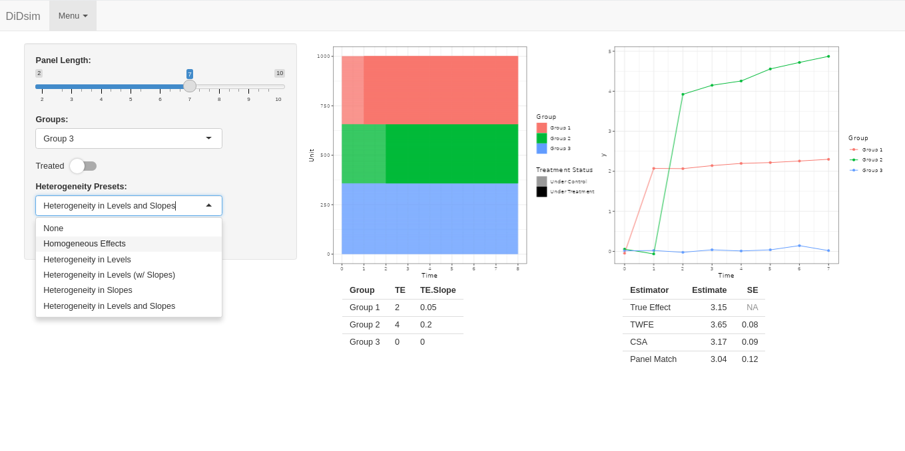

# DiDsim 

`DiDsim` is a compilation of notes and simulation code looking at bias and estimator 
choices for staggered DiD designs. All materials were originally compiled for personal/internal
use at my previous job, as we used staggered DiD designs in a few papers and wanted to get a 
deeper understanding of how certain estimators behaved. 
There are a lot of far better and far more comprehensive resources on staggered DiD out there 
(many of which are referenced in the materials in the `simulations` folder), but I hope condensed notes
with code and a shiny app to play around with add something useful for anyone interested in the topic. 

## Installation & usage

You can install `DiDSim` via: 

```{r}
devtools::install_github("till-tietz/DiDsim")
```
You can run some simulations via the shiny app by calling:

```{r}
DiDsim::run_app()
```

The shiny app lets you diagnose TWFE, CSA and Panel Match estimators and gives you detailed output on bias and 
the underlying structure of the simulated data. 



You can adjust data generating parameters by group as desired. 



And add multiple flavors of between group heterogeneity. 


